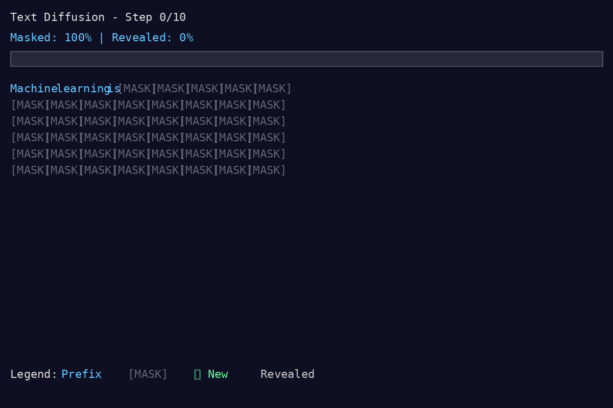

# Text Diffusion Learning Project and Block Discrete Diffusion Models

A toy implementation of discrete text diffusion using RoBERTa for learning and experimentation. Experiments on classification tasks for applications requiring robust, calibrated, and explainable text classification.
With further experiments using GPT2 and discrete text diffusion using GPT2

I'm very concerned that data curation can lead to pushing results chasing a benchmark score with trying to prove these ideas work. 
maybe a LLM-as-Judge for Synthetic Data Generation Loop


Diffusion models for text classification remain largely unexplored with only 3-5 core papers published between 2022-2024, primarily focusing on adversarial robustness and uncertainty quantification rather than accuracy improvements, with ROIC-DM (2024) being the first to directly use diffusion as a text classifier. ccresearch

https://gist.github.com/bigsnarfdude/23ec6b30a53437c436c8c4338ee6678c
https://www.kaggle.com/c/jigsaw-toxic-comment-classification-challenge

## See It In Action!

**Watch text emerge from noise through iterative denoising:**



*The animation shows how the model gradually reveals coherent text from completely masked input over 10 denoising steps.*

### Interactive Viewer

For the best viewing experience, open the interactive HTML viewer:

```bash
# Open in your browser
open assets/view_animation.html

# Or on Linux/remote
python3 -m http.server 8000
# Then visit: http://localhost:8000/assets/view_animation.html
```

The interactive viewer includes:
- Full animation playback with controls
- Individual frame inspection (Step 0-10)
- Color-coded legend explaining the process
- Keyboard shortcuts (R = replay, F = toggle frames)

### Create Your Own Visualizations

```bash
# Generate your own animated visualization
python tools/visualize_generation.py \
  --checkpoint results-full/final-model \
  --prefix "Your prompt here" \
  --max-length 50

# The script creates:
# - text_diffusion_animation.gif (animated GIF)
# - visualization_frames/ (individual PNG frames)
```

See [docs/VISUALIZATION_GUIDE.md](VISUALIZATION_GUIDE.md) for detailed instructions and customization options.

## Three Main Experiments

This repository contains three major experiments:

### 1. Text Generation via Diffusion (Original)
Train a diffusion model to generate text by iteratively denoising masked tokens.

### 2. RoBERTa Diffusion-based Generative Classifier
Use per-class RoBERTa diffusion models for classification via likelihood estimation.
**Result: 94% accuracy on IMDB sentiment classification**

### 3. MDLM Generative Classifier (Latest)
Evaluate pretrained Masked Diffusion Language Models (MDLM) for sentiment classification.
**Result: 62% accuracy - validates MDLM is trainable but not competitive with pretrained LLMs**
**Key Finding: GPT-2's pretraining on movie reviews gives it an insurmountable advantage (90.1% accuracy)**

## Quick Start

### Text Generation
```bash
# Setup
pip install -r requirements.txt

# Or with virtual environment (recommended)
python3 -m venv venv
source venv/bin/activate
pip install -r requirements.txt

# Train small model (fast, for learning)
python src/train.py --quick-test

# Generate text
python src/generate.py --checkpoint results/final-model

# NEW: Create animated visualization!
python tools/visualize_generation.py \
  --checkpoint results/final-model \
  --prefix "Machine learning is" \
  --max-length 50

# View the animation in your browser
open assets/view_animation.html
```

### RoBERTa Diffusion-based Generative Classifier
```bash
# 1. Prepare IMDB dataset (sentiment classification)
python scripts/prepare_imdb.py

# 2. Train per-class diffusion models (10 epochs, ~30 min)
python src/train_generative_classifier.py --epochs 10 --batch-size 16

# 3. Evaluate classifier
python src/evaluate_classifier.py \
  --model-dir results-generative-classifier \
  --max-samples 500

# Expected result: ~94% accuracy
```

### MDLM Generative Classifier
```bash
# 1. Train per-class MDLM models (164 epochs, ~7 hours on GPU)
./train_mdlm_fixed.sh

# 2. Evaluate classifier
python eval_mdlm_quick.py

# Result: 62% accuracy (GPT-2 baseline: 90.1%)
# See MDLM_EXPERIMENT_RESULTS.md for full analysis
```

## MDLM Experiment Results (Latest)

### Overview
**Goal:** Validate if MDLM (Masked Diffusion Language Model) can compete with fine-tuned GPT-2 for sentiment classification.

**Result:** 62% accuracy vs GPT-2's 90.1% baseline

**Key Finding:** MDLM is trainable and learns sentiment patterns (12% above random), but cannot match pretrained LLMs when they have domain knowledge advantages.

### Why MDLM Failed on Sentiment
1. **Pretraining Distribution Mismatch**: GPT-2 was pretrained on internet text including movie reviews
2. **Domain Knowledge Gap**: MDLM must learn sentiment, movie vocabulary, and review structure from scratch
3. **Training Efficiency**: 164 epochs of MDLM training cannot match GPT-2's pretraining advantage

### When to Use MDLM
✅ **Good use cases:**
- Novel abuse patterns (not in LLM training data)
- Specialized domains (medical, legal, industry-specific)
- Speed-critical applications (10x faster inference)
- Multiple specialized classifiers in parallel

❌ **Bad use cases:**
- Tasks where LLMs were pretrained on similar data
- Problems requiring deep semantic understanding
- Domains with complex linguistic nuance

**Full analysis:** See [MDLM_EXPERIMENT_RESULTS.md](MDLM_EXPERIMENT_RESULTS.md)

---

## RoBERTa Diffusion-based Generative Classifier Explained

### What Is Diffusion-based Generative Classifier?

Instead of training a single discriminative model P(class|text), we:
1. Train separate diffusion models for each class: P(text|class_0), P(text|class_1), ...
2. Classify new text by comparing likelihoods: which class model assigns higher probability?
3. Use Bayes rule: argmax P(class|text) ∝ P(text|class) × P(class)

### Why Does This Work?

Each class model learns the language patterns specific to that class:
- **Negative reviews model** learns: "terrible", "waste of time", "boring", "disappointing"
- **Positive reviews model** learns: "amazing", "loved it", "masterpiece", "excellent"

When you give a new review like "This movie was terrible and boring":
- Negative model: High likelihood (these are common words in negative reviews)
- Positive model: Low likelihood (these words rarely appear in positive reviews)
- Classification: NEGATIVE (higher likelihood)

### Results

**Initial attempt (insufficient training):**
- Training: 2,000 samples per class, 3 epochs
- Result: 52.6% accuracy (random guessing!)
- Problem: Both models learned general English, not class-specific patterns

**Successful approach (adequate training):**
- Training: 12,500 samples per class, 10 epochs
- Result: **94% accuracy** on IMDB sentiment classification
- Solution: More data + more epochs → models diverge and learn class-specific language

**Key Insight:** Diffusion-based Generative Classifier works, but requires significantly more training than discriminative approaches to learn distinct P(text|class) distributions.

### Implementation Details

See these files for the complete implementation:
- `src/classifier/trainer.py` - Per-class training (lines 1-267)
- `src/classifier/inference.py` - Likelihood-based classification (lines 1-287)
- `src/classifier/data.py` - IMDB data loading
- `src/train_generative_classifier.py` - Training script
- `src/evaluate_classifier.py` - Evaluation with metrics
- `docs/FIXING_CLASSIFIER.md` - Troubleshooting guide
- `docs/CLASSIFIER_RESULTS.md` - Full experimental results

## Project Structure

```
text-diffusion/
├── README.md                        # This file
├── requirements.txt                 # Dependencies
│
├── src/                             # Core implementation
│   ├── config.py                   # All hyperparameters
│   ├── data_collator.py            # Variable masking (the key innovation)
│   ├── train.py                    # Training script (generation)
│   ├── generate.py                 # Iterative denoising generation
│   ├── train_generative_classifier.py  # Classifier training
│   ├── evaluate_classifier.py      # Classifier evaluation
│   └── classifier/                 # Generative classification
│       ├── trainer.py              # Per-class training
│       ├── inference.py            # Likelihood-based classification
│       └── data.py                 # Data loading
│
├── tools/                           # Visualization & analysis tools
│   ├── visualize_generation.py     # Create animated visualizations
│   └── compare_models.py           # RoBERTa Diffusion vs GPT-2 comparison
│
├── experiments/                     # Experimental scripts
│   ├── masking_viz.py              # Visualize masking strategies
│   ├── schedule_comparison.py      # Compare denoising schedules
│   └── layer_analysis.py           # Analyze model layer behavior
│
├── docs/                            # Documentation
│   ├── LEARNING_GUIDE.md           # Comprehensive technical guide
│   ├── PROJECT_SUMMARY.md          # Architecture & design decisions
│   ├── DEPLOYMENT.md               # Setup & deployment
│   ├── GENERATION_VALIDATION.md    # Sample outputs & quality
│   ├── VISUALIZATION_GUIDE.md      # Visualization usage
│   ├── COMPARISON.md               # vs Original implementation
│   ├── CODE_COMPARISON.md          # Side-by-side code analysis
│   ├── FIXING_CLASSIFIER.md        # Classifier troubleshooting (6 fixes)
│   └── CLASSIFIER_RESULTS.md       # Full experimental results
│
├── MDLM_EXPERIMENT_RESULTS.md      # MDLM classifier experiment & analysis
│
├── assets/                          # Media files
│   ├── text_diffusion_animation.gif # Example animation
│   ├── comparison.gif              # Diffusion vs Autoregressive
│   └── view_animation.html         # Interactive browser viewer
│
├── papers/                          # Reference papers
│   └── 2025-text-diffusion-paper.pdf
│
└── scripts/                         # Data preparation & monitoring
    ├── prepare_imdb.py              # Prepare IMDB dataset for classification
    ├── deploy.sh                    # Deployment script
    └── monitor_training.sh          # Training monitoring
```

## Core Concepts

### 1. Training: Variable Masking
- Each batch randomly gets masking rate: 10%, 20%, ..., 90%, 100%
- Model learns to denoise at ALL corruption levels
- Key insight: Same model, different masking = different denoising tasks

### 2. Generation: Iterative Refinement
- Start: 100% masked (except prefix)
- Step 1: Predict all positions → 90% masked
- Step 2: Predict remaining → 80% masked
- ...
- Step 10: Final polish → Complete text

### 3. Why It Works
- High masking (90-100%): Model learns structure, frequent words
- Medium masking (40-60%): Context-dependent content
- Low masking (10-20%): Fine details, rare tokens

## 🎥 Visualizing the Process

The best way to understand text diffusion is to **watch it happen**! The visualization tool creates an animated GIF showing how text gradually emerges from noise:

```bash
# Create visualization
python tools/visualize_generation.py \
  --checkpoint results-full/final-model \
  --prefix "The future of AI" \
  --max-length 50 \
  --sampling topk \
  --temperature 0.8
```

**What you'll see:**
- 🔵 **Blue progress bar** filling up as denoising progresses
- 🟢 **Green sparkles (✨)** highlighting newly revealed tokens
- ⚪ **White text** showing previously revealed tokens
- 🔘 **Gray [MASK]** tokens still waiting to be predicted
- 📊 **Percentage indicator** showing masked vs. revealed ratio

**Output files:**
- `text_diffusion_animation.gif` - Complete animation (800ms per frame)
- `visualization_frames/` - Individual PNG frames for detailed inspection
- `view_animation.html` - Interactive browser viewer with controls

**Try different settings:**
- **Temperature 0.3** (conservative) vs **1.2** (creative)
- **Greedy sampling** (deterministic) vs **nucleus** (diverse)
- **Linear schedule** vs **cosine** (smoother transitions)

See the complete guide: [VISUALIZATION_GUIDE.md](VISUALIZATION_GUIDE.md)

## 🆚 Compare Diffusion vs Autoregressive

Want to see how RoBERTa Diffusion compares to GPT-2's autoregressive generation?

```bash
# Create side-by-side comparison animation
python tools/compare_models.py \
  --roberta-checkpoint results-full/final-model \
  --gpt2-checkpoint gpt2 \
  --prompt "Machine learning is" \
  --max-length 50 \
  --output comparison.gif
```

**What you'll see:**
- **Top half**: RoBERTa Diffusion - iterative refinement (all positions simultaneously)
- **Bottom half**: GPT-2 - autoregressive generation (left-to-right, one token at a time)
- **Side-by-side visualization** showing the fundamental difference in generation paradigms

**Output:**
- `comparison.gif` - Animated side-by-side comparison
- `comparison_frames/` - Individual frames for analysis

**Key differences visualized:**
- **Diffusion**: Text gradually refines from [MASK] tokens → coherent output
- **Autoregressive**: Text builds left-to-right, one token at a time
- **Speed**: Both take similar time, but different approaches
- **Quality**: Both produce coherent text, different characteristics

## Experiments to Try

### Masking Strategies
```bash
# Linear schedule (default)
python src/generate.py --schedule linear

# Cosine schedule (more time at ends)
python src/generate.py --schedule cosine

# Exponential decay
python src/generate.py --schedule exponential
```

### Sampling Methods
```bash
# Greedy (deterministic)
python src/generate.py --sampling greedy

# Top-k sampling
python src/generate.py --sampling topk --k 50

# Nucleus sampling
python src/generate.py --sampling nucleus --p 0.9

# Temperature control
python src/generate.py --temperature 0.7
```

### Layer Analysis
```bash
# Which layers learn what?
python experiments/layer_analysis.py --checkpoint results/checkpoint-1000
```

## Learning Path

### Phase 1: Understand Training (Today)
1. Run quick training with visualization
2. Watch how different masking levels affect loss
3. Inspect what model predicts at each masking level

### Phase 2: Understand Generation (Tomorrow)
1. Generate with step-by-step output
2. See how text evolves through denoising
3. Try different schedules and compare

### Phase 3: Experiment (This Week)
1. Try different model sizes (distilroberta, roberta-base, roberta-large)
2. Compare masking strategies
3. Analyze layer representations

### Phase 4: Your Domain (Next Week)
1. Fine-tune on your specific text domain
2. Add constraints for structured generation
3. Evaluate on your metrics

## Key Files Explained

### `data_collator.py` - The Training Secret
This is where the magic happens. Standard masked LM training uses 15% masking.
We use VARIABLE masking (10% to 100%) so the model learns the full denoising curve.

### `train.py` - Training Loop
Standard HuggingFace Trainer with:
- Logging for each masking level
- Checkpointing
- Visualization of predictions

### `generate.py` - Iterative Generation
The inference algorithm:
1. Start fully masked
2. For each denoising step:
   - Forward pass → get logits
   - Sample tokens for masked positions
   - Fill in predictions
   - Re-mask fewer positions
3. Return final text

## Monitoring Training

Training logs show loss per masking level:
```
Step 100:
  mask_1.0: 8.234  (100% masked - hardest)
  mask_0.5: 3.456  (50% masked - medium)
  mask_0.1: 1.234  (10% masked - easiest)
```

Good training: All levels decrease, with 100% masked having highest loss.

## Common Issues

### "Model ignoring prefix"
- Check PREFIX_LEN in generate.py
- Increase prefix length during generation
- Train with longer preserved prefixes

### "Repetitive generation"
- Increase temperature (try 0.7-1.0)
- Use top-k or nucleus sampling
- Add more denoising steps

### "Incoherent text"
- Train longer (model underfitted)
- Increase model size
- Use more denoising steps at inference

## Documentation

### Quick References
- **README.md** - This file: project overview and basic usage
- **docs/VISUALIZATION_GUIDE.md** - 🎬 How to create and customize animated visualizations
- **docs/DEPLOYMENT.md** - Setup and deployment guide
- **docs/GENERATION_VALIDATION.md** - Sample outputs and quality assessment

### Deep Dives
- **docs/LEARNING_GUIDE.md** - Comprehensive technical explanation (800 lines)
  - Mathematical intuition
  - Implementation details
  - Debugging strategies
  - Advanced topics
- **docs/PROJECT_SUMMARY.md** - Architecture, design decisions, success criteria
- **docs/PROJECT_INDEX.md** - Complete navigation guide

### Scripts
- **scripts/deploy.sh** - Deployment script for remote servers
- **scripts/monitor_training.sh** - Training progress monitoring
- **requirements.txt** - All dependencies

## Resources

### Original Work
- Original blog: https://nathan.rs/posts/roberta-diffusion/

### Papers
- RoBERTa paper: https://arxiv.org/abs/1907.11692
- D3PM (discrete diffusion): https://arxiv.org/abs/2107.03006
- BERT: https://arxiv.org/abs/1810.04805

### Tools
- HuggingFace Transformers: https://huggingface.co/docs/transformers
- PyTorch: https://pytorch.org/docs/stable/index.html

## Next Steps

### Immediate (Today)
1. Setup: `pip install -r requirements.txt`
2. Visualize: `python experiments/masking_viz.py`
3. Train: `python src/train.py --quick-test`
4. Generate: `python src/generate.py --checkpoint results/final-model`

### Short-term (This Week)
1. Read docs/LEARNING_GUIDE.md for deep understanding
2. Try different sampling strategies and schedules
3. Experiment with hyperparameters

### Medium-term (Research)
1. Train with more epochs for better quality
2. Experiment with non-uniform masking distributions
3. Add classifier guidance for controlled generation
4. Implement parallel decoding (faster generation)

## Contributing

This is a learning project. Feel free to:
- Experiment with different approaches
- Try different model architectures
- Test on different datasets
- Share your findings!

Happy learning! 🚀
